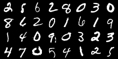

# GAN-MNIST
This repo is a pytorch implementation of a Simple and straightforward 
Generative Adversarial Network (GAN)
GANs, also known as Generative Adversarial Networks, are one of the most fascinating new developments in deep learning.
Yann LeCun saw GANs as "the most fascinating idea in the last 10 years in ML" when Ian Goodfellow and Yoshua Bengio from the University of Montreal first unveiled them in 2014.
GANS are frequently used to make deep fake films, improve the quality of images, face swap, design gaming characters, and much more. 
# Setup and Generate
ode is developed under following library dependencies
```commandline
python 3.8
torch 1.12.0
torchvision 0.13.0
```
Start with creating a virtual environment then open your terminal and follow the following steps:
```commandline
git clone "https://github.com/zaghlol94/GAN-MNIST"
cd GAN-MNIST
pip install -r requirements.txt
bash download_assets.sh
cd src
python generate.py
```

# Results
### Fake


### Real

